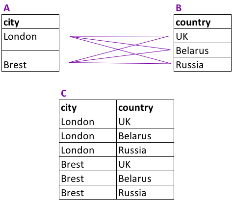

# БАЗОВЫЕ ЗАПРОСЫ SQL
## Задача 1.
На заметку:  

Оператор FROM всегда указывается после оператора SELECT. В обратном порядке их записывать нельзя — база данных вернёт ошибку.

Задание:  

Выведите все записи из таблицы products.

Поля в результирующей таблице: product_id, name, price

``` sql
SELECT *
FROM   products
```
## Задача 2.
На заметку:

Оператор ORDER BY всегда указывается после операторов SELECT и FROM.

Задание:

Выведите все записи из таблицы products, отсортировав их по наименованиям товаров в алфавитном порядке, т.е. по возрастанию. Для сортировки используйте оператор ORDER BY.

Поля в результирующей таблице: product_id, name, price
``` sql
SELECT *
FROM   products
ORDER BY name
```
## Задача 3.
Задание:

Отсортируйте таблицу courier_actions сначала по колонке courier_id по возрастанию id курьера, потом по колонке action (снова по возрастанию), а затем по колонке time, но уже по убыванию — от самого последнего действия к самому первому. Не забудьте включить в результат колонку order_id.

Добавьте в запрос оператор LIMIT и выведите только первые 1000 строк результирующей таблицы.

Поля в результирующей таблице: courier_id, order_id, action, time
``` sql
SELECT courier_id,
       order_id,
       action,
       time
FROM   courier_actions
ORDER BY 1, 3, time desc limit 1000
```
## Задача 4.
Сейчас важно запомнить порядок записи всех известных нам ключевых слов:

1. SELECT
2. FROM
3. ORDER BY
4. LIMIT
Также важно понять, что порядок их выполнения несколько отличается от того, в какой последовательности они указываются в SQL-запросе:

Сначала выполняется оператор FROM — происходит выбор нужной таблицы.
Затем SELECT — отбираются указанные столбцы.
Потом ORDER BY — производится сортировка результирующей таблицы.
И в самом конце LIMIT — ограничивается количество выводимых записей.
Подробнее о порядке выполнения операторов мы будем ещё не раз говорить в последующих уроках. 

А сейчас давайте попробуем с помощью всех этих знаний решить несложную практическую задачу.

Задание:

Используя операторы SELECT, FROM, ORDER BY и LIMIT, определите 5 самых дорогих товаров в таблице products, которые доставляет наш сервис. Выведите их наименования и цену.

Поля в результирующей таблице: name, price


``` sql
select
  name,
  price
from
  products
ORDER BY
  price desc
limit
  5
```
## Задача 5.
Задание:

Повторите запрос из предыдущего задания, но теперь колонки name и price переименуйте соответственно в product_name и product_price.

Поля в результирующей таблице: product_name, product_price
``` sql
SELECT name product_name,
       price product_price
FROM   products
ORDER BY price desc limit 5
```
## Задача 6.
Задание:

Используя операторы SELECT, FROM, ORDER BY и LIMIT, а также функцию LENGTH, определите товар с самым длинным названием в таблице products. Выведите его наименование, длину наименования в символах, а также цену этого товара. Колонку с длиной наименования в символах назовите name_length.

Поля в результирующей таблице: name, name_length, price
``` sql
SELECT name,
       length(name) as name_length,
       price
FROM   products
ORDER BY 2 desc limit 1
```
## Задача 7.
Задание:

Примените последовательно функции UPPER и SPLIT_PART к колонке name и преобразуйте наименования товаров в таблице products так, чтобы от названий осталось только первое слово, записанное в верхнем регистре. Колонку с новым названием, состоящим из первого слова, назовите first_word.

В результат включите исходные наименования товаров, новые наименования из первого слова, а также цену товаров. Результат отсортируйте по возрастанию исходного наименования товара в колонке name.

Поля в результирующей таблице: name, first_word, price
``` sql
SELECT name,
       upper(split_part(name, ' ', 1)) as first_word,
       price
FROM   products
ORDER BY name
```
## Задача 8.
Задание:

Измените тип колонки price из таблицы products на VARCHAR. Выведите колонки с наименованием товаров, ценой в исходном формате и ценой в формате VARCHAR. Новую колонку с ценой в новом формате назовите price_char.

Результат отсортируйте по возрастанию исходного наименования товара в колонке name. Количество выводимых записей не ограничивайте.

Поле в результирующей таблице: name, price, price_char
``` sql
SELECT name,
       price,
       price::varchar as price_char
FROM   products
ORDER BY name
```
## Задача 9.

Задание:

Для первых 200 записей из таблицы orders выведите информацию в следующем виде (обратите внимание на пробелы):

Заказ № [id_заказа] создан [дата]

Полученную колонку назовите order_info.

Пример вывода:

Заказ № 65 создан 2022-09-01


Пояснение:

При указании текстовых значений используйте одинарные кавычки.

Чтобы извлечь дату из значений в колонке creation_time, достаточно применить к ней функцию DATE или изменить её тип на DATE
``` sql
SELECT concat('Заказ № ', order_id, ' создан ', creation_time::date) as order_info
FROM   orders limit 200
```
## Задача 10.
Задание:

Выведите id всех курьеров и их годы рождения из таблицы couriers.

Год рождения необходимо получить из колонки birth_date. Новую колонку с годом назовите birth_year. Результат отсортируйте сначала по убыванию года рождения курьера (т.е. от самых младших к самым старшим), затем по возрастанию id курьера.

Поля в результирующей таблице: courier_id, birth_year
``` sql
SELECT courier_id,
       date_part('year', birth_date) as birth_year
FROM   couriers
ORDER BY birth_year desc, courier_id
```
## * Задача 11.
Задание:

Как и в предыдущем задании, снова выведите id всех курьеров и их годы рождения, только теперь к извлеченному году примените функцию COALESCE. Укажите параметры функции так, чтобы вместо NULL значений в результат попадало текстовое значение unknown. Названия полей оставьте прежними.

Отсортируйте итоговую таблицу сначала по убыванию года рождения курьера, затем по возрастанию id курьера.

Поля в результирующей таблице: courier_id, birth_year

Пояснение:

При указании текстового значения используйте одинарные кавычки, как в примерах выше.

Не забудьте учесть, что unknown — значение типа VARCHAR, а значит, извлечённый из даты год нужно тоже привести к этому типу. Поэтому сначала извлеките год, затем преобразуйте его в текст и далее применяйте к полученному значению функцию COALESCE.
``` sql
SELECT courier_id,
       COALESCE(date_part('year', birth_date)::varchar, 'unknown') as birth_year
FROM   couriers
ORDER BY birth_year desc, courier_id
```
## Задача 12.
Задание:

Давайте представим, что по какой-то необъяснимой причине мы вдруг решили в одночасье повысить цену всех товаров в таблице products на 5%.

Выведите id и наименования всех товаров, их старую и новую цену. Колонку со старой ценой назовите old_price, а колонку с новой — new_price.

Результат отсортируйте сначала по убыванию новой цены, затем по возрастанию id товара.

Поля в результирующей таблице: product_id, name, old_price, new_price
``` sql
SELECT product_id,
       name,
       price as old_price,
       price * 1.05 as new_price
FROM   products
ORDER BY new_price desc, product_id
```
## Задача 13.
Задание:

Вновь, как и в прошлом задании, повысьте цену всех товаров на 5%, только теперь к колонке с новой ценой примените функцию ROUND. Выведите id и наименования товаров, их старую цену, а также новую цену с округлением. Новую цену округлите до одного знака после запятой, но тип данных не меняйте.

Результат отсортируйте сначала по убыванию новой цены, затем по возрастанию id товара.

Поля в результирующей таблице: product_id, name, old_price, new_price
``` sql
SELECT product_id,
       name,
       price as old_price,
       round(price * 1.05, 1) as new_price
FROM   products
ORDER BY new_price desc, product_id
```
## Задача 14.
Задание:

Повысьте цену на 5% только на те товары, цена которых превышает 100 рублей. Цену остальных товаров оставьте без изменений. Также не повышайте цену на икру, которая и так стоит 800 рублей. Выведите id и наименования всех товаров, их старую и новую цену. Цену округлять не нужно.

Результат отсортируйте сначала по убыванию новой цены, затем по возрастанию id товара.

Поля в результирующей таблице: product_id, name, old_price, new_price
``` sql
SELECT product_id,
       name,
       price as old_price,
       case when name = 'икра' then price
            when price > 100 then price * 1.05
            else price end as new_price
FROM   products
ORDER BY new_price desc, product_id
```
## Задача 15.
Задание:

Вычислите НДС каждого товара в таблице products и рассчитайте цену без учёта НДС. Выведите всю информацию о товарах, включая сумму налога и цену без его учёта. Колонки с суммой налога и ценой без НДС назовите соответственно tax и price_before_tax. Округлите значения в этих колонках до двух знаков после запятой.

Результат отсортируйте сначала по убыванию цены товара без учёта НДС, затем по возрастанию id товара.

Поля в результирующей таблице: product_id, name, price, tax, price_before_tax
``` sql
SELECT product_id,
       name,
       price,
       round(price / 1.2 * 0.2, 2) as tax,
       round(price - (price / 1.2 * 0.2), 2) as price_before_tax
FROM   products
ORDER BY price_before_tax desc, product_id
```

# Подведём итоги
На этом уроке мы:

- Познакомились с операторами SELECT и FROM и научились составлять базовые запросы.
- Узнали, как сортировать записи с помощью оператора ORDER BY.
- Научились ограничивать количество выводимых записей с помощью оператора LIMIT.
- Выяснили, как преобразовывать типы данных с помощью CAST.
- Научились работать с датой и временем и познакомились с функцией DATE_PART.
- Узнали про NULL значения и поработали с COALESCE.
- Научились работать с текстовыми данными и соединять строки с помощью функции CONCAT.
- Поработали с арифметическими операторами и математическими функциями.
- Познакомились с конструкцией CASE и научились составлять комплексные логические выражения.

Известные нам на текущий момент ключевые слова и порядок их написания в запросе:
```
SELECT    -- перечисление полей результирующей таблицы
FROM      -- указание источника данных
ORDER BY  -- сортировка результирующей таблицы
LIMIT     -- ограничение количества выводимых записей
```
---
# ФИЛЬТРАЦИЯ ДАННЫХ

## Задача 1.
Задание:

Напишите SQL-запрос к таблице products и выведите всю информацию о товарах, цена которых не превышает 100 рублей. Результат отсортируйте по возрастанию id товара.

Поля в результирующей таблице: product_id, name, price


``` sql
SELECT product_id,
       name,
       price
FROM   products
WHERE  price <= 100
ORDER BY product_id
```
## Задача 2.
Задание:

Отберите пользователей женского пола из таблицы users. Выведите только id этих пользователей. Результат отсортируйте по возрастанию id.

Добавьте в запрос оператор LIMIT и выведите только 1000 первых id из отсортированного списка.

Поле в результирующей таблице: user_id


``` sql
SELECT user_id
FROM   users
WHERE  sex = 'female'
ORDER BY user_id limit 1000
```
## Задача 3.
Задание:

Отберите из таблицы user_actions все действия пользователей по созданию заказов, которые были совершены ими после полуночи 6 сентября 2022 года. Выведите колонки с id пользователей, id созданных заказов и временем их создания.

Результат должен быть отсортирован по возрастанию id заказа.

Поля в результирующей таблице: user_id, order_id, time
``` sql
SELECT user_id,
       order_id,
       time
FROM   user_actions
WHERE  time >= '2022-09-06'
   and action = 'create_order'
ORDER BY order_id
```
## Задача 4.
Задание:

Назначьте скидку 20% на все товары из таблицы products и отберите те, цена на которые с учётом скидки превышает 100 рублей. Выведите id товаров, их наименования, прежнюю цену и новую цену с учётом скидки. Колонку со старой ценой назовите old_price, с новой — new_price.

Результат должен быть отсортирован по возрастанию id товара.

Поля в результирующей таблице: product_id, name, old_price, new_price
``` sql
SELECT product_id,
       name,
       price as old_price,
       price * 0.8 as new_price
FROM   products
WHERE  price * 0.8 > 100
ORDER BY product_id
```
## Задача 5.
Задание:

Отберите из таблицы products все товары, названия которых либо начинаются со слова «чай», либо состоят из пяти символов. Выведите две колонки: id товаров и их наименования.

Результат должен быть отсортирован по возрастанию id товара.

Поля в результирующей таблице: product_id, name
``` sql
SELECT product_id,
       name
FROM   products
WHERE  split_part(name, ' ', 1) = 'чай'
    or length(name) = 5
ORDER BY product_id
```
## Задача 6.
Задание:

Отберите из таблицы products все товары, содержащие в своём названии последовательность символов «чай» (без кавычек). Выведите две колонки: id продукта и его название.

Результат должен быть отсортирован по возрастанию id товара.

Поля в результирующей таблице: product_id, name
``` sql
SELECT product_id,
       name
FROM   products
WHERE  name like '%чай%'
ORDER BY product_id
```
## Задача 7.
Задание:

Выберите из таблицы products id и наименования только тех товаров, названия которых начинаются на букву «с» и содержат только одно слово.

Результат должен быть отсортирован по возрастанию id товара.

Поля в результирующей таблице: product_id, name
``` sql
SELECT product_id,
       name
FROM   products
WHERE  name like 'с%'
   and name not like '% %'
ORDER BY product_id
```
## Задача 8.
Задание:

Составьте SQL-запрос, который выбирает из таблицы products все чаи стоимостью больше 60 рублей и вычисляет для них цену со скидкой 25%.

Скидку в % менеджер попросил указать в отдельном столбце в формате текста, то есть вот так: «25%» (без кавычек). Столбцы со скидкой и новой ценой назовите соответственно discount и new_price.

Также необходимо любым известным способом избавиться от «чайного гриба»: вряд ли менеджер имел в виду и его, когда ставил нам задачу.

Результат должен быть отсортирован по возрастанию id товара.

Поля в результирующей таблице: product_id, name, price, discount, new_price
``` sql
SELECT product_id,
       name,
       price,
       '25%' as discount,
       price * 0.75 as new_price
FROM   products
WHERE  name like '%чай%'
   and name not like 'чайный гриб'
   and price > 60
ORDER BY product_id
```
## Задача 9.
Задание:

Из таблицы user_actions выведите всю информацию о действиях пользователей с id 170, 200 и 230 за период с 25 августа по 4 сентября 2022 года включительно. Результат отсортируйте по убыванию id заказа — то есть от самых поздних действий к самым первым.

Поля в результирующей таблице: user_id, order_id, action, time
``` sql
SELECT user_id,
       order_id,
       action,
       time
FROM   user_actions
WHERE  user_id in (170, 200, 230)
   and time between '2022-08-25'
   and '2022-09-05'
ORDER BY order_id desc
```
## Задача 10.
Задание:

Напишите SQL-запрос к таблице couriers и выведите всю информацию о курьерах, у которых не указан их день рождения.

Результат должен быть отсортирован по возрастанию id курьера.

Поля в результирующей таблице: birth_date, courier_id, sex
``` sql
SELECT birth_date,
       courier_id,
       sex
FROM   couriers
WHERE  birth_date is null
ORDER BY courier_id
```
## Задача 11.
Задание:

Определите id и даты рождения 50 самых молодых пользователей мужского пола из таблицы users. Не учитывайте тех пользователей, у которых не указана дата рождения.

Поле в результирующей таблице: user_id, birth_date


``` sql
SELECT user_id,
       birth_date
FROM   users
WHERE  birth_date is not null
   and sex = 'male'
ORDER BY birth_date desc limit 50
```
## Задача 12.

Задание:

Напишите SQL-запрос к таблице courier_actions, чтобы узнать id и время доставки последних 10 заказов, доставленных курьером с id 100.

Поля в результирующей таблице: order_id, time
``` sql
SELECT order_id,
       time
FROM   courier_actions
WHERE  courier_id = 100
   and action = 'deliver_order'
ORDER BY time desc limit 10
```
## Задача 13.
Задание:

Из таблицы user_actions получите id всех заказов, сделанных пользователями сервиса в августе 2022 года.

Результат отсортируйте по возрастанию id заказа.

Поле в результирующей таблице: order_id

``` sql
SELECT order_id
FROM   user_actions
WHERE  time between '2022-08-01'
   and '2022-09-01'
   and action = 'create_order'
ORDER BY order_id
```
## Задача 14.
Задание:

Из таблицы couriers отберите id всех курьеров, родившихся в период с 1990 по 1995 год включительно.

Результат отсортируйте по возрастанию id курьера.

Поле в результирующей таблице: courier_id

``` sql
SELECT courier_id
FROM   couriers
WHERE  date_part('year', birth_date) >= 1990
   and date_part('year', birth_date) <= 1995
ORDER BY courier_id
```
## Задача 15.
Задание:

Из таблицы user_actions получите информацию о всех отменах заказов, которые пользователи совершали в течение августа 2022 года по средам с 12:00 до 15:59.

Результат отсортируйте по убыванию id отменённых заказов.

Поля в результирующей таблице: user_id, order_id, action, time

``` sql
SELECT user_id,
       order_id,
       action,
       time
FROM   user_actions
WHERE  action = 'cancel_order'
   and date_part ('dow', time) = 3
   and date_part ('month' , time) = 8
   and date_part('hour', time) between 12
   and 15
   and date_part('year', time) = 2022
ORDER BY order_id desc
```
## 

``` sql
SELECT product_id,
       name,
       price,
       case when name in ('сахар', 'сухарики', 'сушки', 'семечки', 'масло льняное', 'виноград', 'масло оливковое', 'арбуз', 'батон', 'йогурт', 'сливки', 'гречка', 'овсянка', 'макароны', 'баранина', 'апельсины', 'бублики', 'хлеб', 'горох', 'сметана', 'рыба копченая', 'мука', 'шпроты', 'сосиски', 'свинина', 'рис', 'масло кунжутное', 'сгущенка', 'ананас', 'говядина', 'соль', 'рыба вяленая', 'масло подсолнечное', 'яблоки', 'груши', 'лепешка', 'молоко', 'курица', 'лаваш', 'вафли', 'мандарины') then round(price / 1.1 * 0.1, 2)
            else round(price / 1.2 * 0.2, 2) end as tax,
       case when name in ('сахар', 'сухарики', 'сушки', 'семечки', 'масло льняное', 'виноград', 'масло оливковое', 'арбуз', 'батон', 'йогурт', 'сливки', 'гречка', 'овсянка', 'макароны', 'баранина', 'апельсины', 'бублики', 'хлеб', 'горох', 'сметана', 'рыба копченая', 'мука', 'шпроты', 'сосиски', 'свинина', 'рис', 'масло кунжутное', 'сгущенка', 'ананас', 'говядина', 'соль', 'рыба вяленая', 'масло подсолнечное', 'яблоки', 'груши', 'лепешка', 'молоко', 'курица', 'лаваш', 'вафли', 'мандарины') then round(price - (price / 1.1 * 0.1), 2)
            else round(price - (price / 1.2 * 0.2), 2) end as price_before_tax
FROM   products
ORDER BY price_before_tax desc, product_id
```
# Подведём итоги
В этом уроке мы:

- Научились фильтровать данные и применять логические выражения в блоке WHERE.
- Выяснили, что фильтрацию можно делать сразу по расчётным полям с применением функций к колонкам.
- Разобрались, как задавать шаблоны для текстовых значений с помощью оператора LIKE.
- Познакомились с операторами IN и BETWEEN.
- Узнали ещё больше о NULL значениях и научились отфильтровывать их с помощью IS NULL.
- Поработали с датами и временем и научились задавать диапазоны значений.
- Совместили новые знания с информацией из прошлого урока и решили большую задачу на CASE.
---
# АГРЕГАЦИЯ ДАННЫХ
## Задача 1.
Задание:

Выведите id всех уникальных пользователей из таблицы user_actions. Результат отсортируйте по возрастанию id.

Поле в результирующей таблице: user_id

``` sql
SELECT DISTINCT user_id
FROM   user_actions
ORDER BY user_id
```
## Задача 2.
Задание:

Примените DISTINCT сразу к двум колонкам таблицы courier_actions и отберите уникальные пары значений courier_id и order_id.

Результат отсортируйте сначала по возрастанию id курьера, затем по возрастанию id заказа.

Поля в результирующей таблице: courier_id, order_id
``` sql
SELECT DISTINCT courier_id,
                order_id
FROM   courier_actions
ORDER BY courier_id, order_id
```
## Задача 3.
Посчитайте максимальную и минимальную цены товаров в таблице products. Поля назовите соответственно max_price, min_price.

Поля в результирующей таблице: max_price, min_price

``` sql
SELECT max(price) as max_price,
       min(price) as min_price
FROM   products
```
## Задача 4.
Задание:

Как вы помните, в таблице users у некоторых пользователей не были указаны их даты рождения.

Посчитайте в одном запросе количество всех записей в таблице и количество только тех записей, для которых в колонке birth_date указана дата рождения.

Колонку с общим числом записей назовите dates, а колонку с записями без пропусков — dates_not_null.

Поля в результирующей таблице: dates, dates_not_null

``` sql
SELECT count(*) as dates,
       count(birth_date) as dates_not_null
FROM   users
```
## Задача 5.

Задача:

Посчитайте количество всех значений в колонке user_id в таблице user_actions, а также количество уникальных значений в этой колонке (т.е. количество уникальных пользователей сервиса).

Колонку с первым полученным значением назовите users, а колонку со вторым — unique_users.

Поля в результирующей таблице: users, unique_users


``` sql
SELECT count(user_id) as users,
       count(distinct user_id) as unique_users
FROM   user_actions
```
## Задача 6.
Задание:

Посчитайте количество курьеров женского пола в таблице couriers. Полученный столбец с одним значением назовите couriers.

Поле в результирующей таблице: couriers


``` sql
SELECT count(*) as couriers
FROM   couriers
WHERE  sex = 'female'
```
## Задача 7.
Задача:

Рассчитайте время, когда были совершены первая и последняя доставки заказов в таблице courier_actions.

Колонку с временем первой доставки назовите first_delivery, а колонку с временем последней — last_delivery.

Поля в результирующей таблице: first_delivery, last_delivery


``` sql
SELECT min(time) as first_delivery,
       max(time) as last_delivery
FROM   courier_actions
WHERE  action = 'deliver_order'
```
## Задача 8.

Задание:

Представьте, что один из пользователей сервиса сделал заказ, в который вошли одна пачка сухариков, одна пачка чипсов и один энергетический напиток. Посчитайте стоимость такого заказа.

Колонку с рассчитанной стоимостью заказа назовите order_price.

Для расчётов используйте таблицу products.

Поле в результирующей таблице: order_price


``` sql
SELECT sum(price) as order_price
FROM   products
WHERE  name in ('сухарики', 'чипсы', 'энергетический напиток')
```
## Задача 9.

Задание:

Посчитайте количество заказов в таблице orders с девятью и более товарами. Для этого воспользуйтесь функцией array_length, отфильтруйте данные по количеству товаров в заказе и проведите агрегацию. Полученный столбец назовите orders.

Поле в результирующей таблице: orders
``` sql
SELECT count(*) as orders
FROM   orders
WHERE  array_length(product_ids, 1) >= 9
```
## Задача 10.

Задание:

С помощью функции AGE и агрегирующей функции рассчитайте возраст самого молодого курьера мужского пола в таблице couriers.

Возраст выразите количеством лет, месяцев и дней (как в примере выше), переведя его в тип VARCHAR. 

В качестве даты, относительно которой считать возраст курьеров, используйте свою текущую дату (либо не указывайте её на месте первого аргумента, как показано в примерах).

Полученную колонку со значением возраста назовите min_age.

Поле в результирующей таблице: min_age
``` sql
SELECT age(current_date, max(birth_date))::varchar as min_age
FROM   couriers
WHERE  sex = 'male'
```
## Задача 11.

Задание:

Посчитайте стоимость заказа, в котором будут три пачки сухариков, две пачки чипсов и один энергетический напиток. Колонку с рассчитанной стоимостью заказа назовите order_price.

Для расчётов используйте таблицу products.

Поле в результирующей таблице: order_price


``` sql
SELECT sum(case when name = 'сухарики' then price * 3
                when name = 'чипсы' then price * 2
                when name = 'энергетический напиток' then price
                else 0 end) as order_price
FROM   products
```
## Задача 12.
Задание:

Рассчитайте среднюю цену товаров в таблице products, в названиях которых присутствуют слова «чай» или «кофе». Любым известным способом исключите из расчёта товары, содержащие в названии «иван-чай» или «чайный гриб».

Среднюю цену округлите до двух знаков после запятой. Столбец с полученным значением назовите avg_price.

Поле в результирующей таблице: avg_price

``` sql
SELECT round(avg(price), 2) as avg_price
FROM   products
WHERE  (name ilike '%чай%'
    or name ilike '%кофе%')
   and name not ilike '%иван-чай%'
   and name not ilike '%чайный гриб%'
```
## Задача 13.
Задание:

Воспользуйтесь функцией AGE и рассчитайте разницу в возрасте между самым старым и самым молодым пользователями мужского пола в таблице users. 

Разницу в возрасте выразите количеством лет, месяцев и дней, переведя её в тип VARCHAR. 

Колонку с посчитанным значением назовите age_diff.

Поле в результирующей таблице: age_diff

``` sql
SELECT age(max(birth_date), min(birth_date))::varchar as age_diff
FROM   users
WHERE  sex = 'male'
```
## Задача 14.
Задание:

Рассчитайте среднее количество товаров в заказах из таблицы orders, которые пользователи оформляли по выходным дням (суббота и воскресенье) в течение всего времени работы сервиса.

Полученное значение округлите до двух знаков после запятой. Колонку с ним назовите avg_order_size.

Поле в результирующей таблице: avg_order_size

``` sql
SELECT round(avg(array_length(product_ids, 1)), 2) as avg_order_size
FROM   orders
WHERE  date_part('dow', creation_time) in (6, 0)
```
## Задача 15.

Задание:

На основе данных в таблице user_actions посчитайте количество уникальных пользователей сервиса, количество уникальных заказов, поделите одно на другое и выясните, сколько заказов приходится на одного пользователя.

В результирующей таблице отразите все три значения — поля назовите соответственно unique_users, unique_orders, orders_per_user.

Показатель числа заказов на пользователя округлите до двух знаков после запятой.

Поля в результирующей таблице: unique_users, unique_orders, orders_per_user


``` sql
SELECT count(distinct user_id) as unique_users,
       count(distinct order_id) as unique_orders,
       round(count(distinct order_id)::decimal / count(distinct user_id)::decimal,
             2) as orders_per_user
FROM   user_actions
```
## * Задача 16.

Задание:

Посчитайте, сколько пользователей никогда не отменяли свой заказ. Для этого из общего числа всех уникальных пользователей отнимите число уникальных пользователей, которые хотя бы раз отменяли заказ. Подумайте, какое условие необходимо указать в FILTER, чтобы получить корректный результат.

Полученный столбец назовите users_count.

Поле в результирующей таблице: users_count
``` sql
SELECT count(distinct user_id) - count(distinct user_id) filter (WHERE action = 'cancel_order') as users_count
FROM   user_actions
```
## * Задача 17.
Задание:

Посчитайте общее количество заказов в таблице orders, количество заказов с пятью и более товарами и найдите долю заказов с пятью и более товарами в общем количестве заказов.

В результирующей таблице отразите все три значения — поля назовите соответственно orders, large_orders, large_orders_share.

Долю заказов с пятью и более товарами в общем количестве товаров округлите до двух знаков после запятой.

Поля в результирующей таблице: orders, large_orders, large_orders_share

``` sql
SELECT count(order_id) as orders,
       count(order_id) filter (WHERE array_length(product_ids, 1) >= 5) as large_orders,
       round(count(order_id) filter (WHERE array_length(product_ids, 1) >= 5) / count(order_id)::decimal,
             2) as large_orders_share
FROM   orders
```

# Подведём итоги

В этом уроке мы:

- Познакомились с ключевым словом DISTINCT.
- Разобрались, как работают агрегирующие функции SUM, MIN, MAX, COUNT.
- Узнали разницу между COUNT(*) и COUNT(column).
- Научились совмещать фильтрацию и агрегацию в одном запросе.
- Поработали с массивами и узнали, что делает функция array_length.
- Узнали ещё больше про даты и время и познакомились с функцией AGE.
- Затронули более продвинутую тему — агрегатные выражения с фильтрацией.
---
# ГРУППИРОВКА ДАННЫХ
Таким образом, порядок записи ключевых слов выглядит так:

- SELECT
- FROM
- WHERE
- GROUP BY
- ORDER BY
- LIMIT
В то же время порядок выполнения операторов в запросе следующий:

- Сначала выполняется оператор FROM — происходит выбор нужной таблицы.
- Далее WHERE — отфильтровываются строки, соответствующие условию.
- Потом GROUP BY — строки объединяются в группы и производится агрегация.
- Затем SELECT — отбираются указанные столбцы.
- Потом ORDER BY — производится сортировка результирующей таблицы.
- И в самом конце LIMIT — ограничивается количество выводимых записей.
## Задача 1. 
Задание:

С помощью оператора GROUP BY посчитайте количество курьеров мужского и женского пола в таблице couriers.

Новую колонку с числом курьеров назовите couriers_count.

Результат отсортируйте по этой колонке по возрастанию.

Поля в результирующей таблице: sex, couriers_count


``` sql
SELECT sex,
       count(courier_id) as couriers_count
FROM   couriers
GROUP BY sex
ORDER BY couriers_count
```
## Задача 2.
Задание:

Посчитайте количество созданных и отменённых заказов в таблице user_actions.

Новую колонку с числом заказов назовите orders_count.

Результат отсортируйте по числу заказов по возрастанию.

Поля в результирующей таблице: action, orders_count

``` sql
SELECT action,
       count(*) as orders_count
FROM   user_actions
GROUP BY action
ORDER BY orders_count
```
## Задача 3.
Задание:

Используя группировку и функцию DATE_TRUNC, приведите все даты к началу месяца и посчитайте, сколько заказов было сделано в каждом из них.

Расчёты проведите по таблице orders. Колонку с усечённой датой назовите month, колонку с количеством заказов — orders_count.

Результат отсортируйте по месяцам — по возрастанию.

Поля в результирующей таблице: month, orders_count

``` sql
SELECT date_trunc('month', creation_time)as month,
       count(*) as orders_count
FROM   orders
GROUP BY month
ORDER BY month
```
## Задача 4.
Задание:

Используя группировку и функцию DATE_TRUNC, приведите все даты к началу месяца и посчитайте, сколько заказов было сделано и сколько было отменено в каждом из них.

В этот раз расчёты проведите по таблице user_actions. Колонку с усечённой датой назовите month, колонку с количеством заказов — orders_count.

Результат отсортируйте сначала по месяцам — по возрастанию, затем по типу действия — тоже по возрастанию.

Поля в результирующей таблице: month, action, orders_count

``` sql
SELECT date_trunc('month', time)as month,
       action,
       count(*) as orders_count
FROM   user_actions
GROUP BY month, action
ORDER BY month, action
```
## Задача 5.
Задание:

По данным в таблице users посчитайте максимальный порядковый номер месяца среди всех порядковых номеров месяцев рождения пользователей сервиса. С помощью группировки проведите расчёты отдельно в двух группах — для пользователей мужского и женского пола.

Новую колонку с максимальным номером месяца рождения в группах назовите max_month. Преобразуйте значения в новой колонке в формат INTEGER, чтобы порядковый номер был выражен целым числом.

Результат отсортируйте по колонке с полом пользователей.

Поля в результирующей таблице: sex, max_month 

``` sql
SELECT sex,
       max(date_part('month', birth_date))::integer as max_month
FROM   users
GROUP BY sex
ORDER BY sex
```
## Задача 6. 
Задание:

По данным в таблице users посчитайте порядковый номер месяца рождения самого молодого пользователя сервиса. С помощью группировки проведите расчёты отдельно в двух группах — для пользователей мужского и женского пола.

Новую колонку с максимальным номером месяца рождения в группах назовите max_month. Преобразуйте значения в новой колонке в формат INTEGER, чтобы порядковый номер был выражен целым числом.

Результат отсортируйте по колонке с полом пользователей.

Поля в результирующей таблице: sex, max_month

``` sql
SELECT sex,
       date_part('month', max(birth_date))::integer as max_month
FROM   users
GROUP BY sex
ORDER BY sex
```
## Задача 7.


Задание:

Посчитайте максимальный возраст пользователей мужского и женского пола в таблице users. Возраст измерьте числом полных лет.

Новую колонку с возрастом назовите max_age. Преобразуйте значения в новой колонке в формат INTEGER, чтобы возраст был выражен целым числом.

Результат отсортируйте по новой колонке по возрастанию возраста.

Поля в результирующей таблице: sex, max_age
``` sql
SELECT sex,
       date_part('year', age(current_date, min(birth_date)))::integer as max_age
FROM   users
GROUP BY sex
ORDER BY max_age
```
## Задача 8.
Задание:

Разбейте пользователей из таблицы users на группы по возрасту (возраст по-прежнему измеряем числом полных лет) и посчитайте количество пользователей каждого возраста.

Колонку с возрастом назовите age, а колонку с числом пользователей — users_count. Преобразуйте значения в колонке с возрастом в формат INTEGER, чтобы возраст был выражен целым числом.

Результат отсортируйте по колонке с возрастом по возрастанию.

Поля в результирующей таблице: age, users_count

``` sql
SELECT date_part('year', age(current_date, (birth_date)))::integer as age,
       count(*) as users_count
FROM   users
GROUP BY age
ORDER BY age
```
## Задача 9.

Задание:

Вновь разбейте пользователей из таблицы users на группы по возрасту (возраст по-прежнему измеряем количеством полных лет), только теперь добавьте в группировку ещё и пол пользователя. Затем посчитайте количество пользователей в каждой половозрастной группе.

Все NULL значения в колонке birth_date заранее отфильтруйте с помощью WHERE.

Колонку с возрастом назовите age, а колонку с числом пользователей — users_count, имя колонки с полом оставьте без изменений. Преобразуйте значения в колонке с возрастом в формат INTEGER, чтобы возраст был выражен целым числом.

Отсортируйте полученную таблицу сначала по колонке с возрастом по возрастанию, затем по колонке с полом — тоже по возрастанию.

Поля в результирующей таблице: age, sex, users_count

``` sql
SELECT date_part('year', age(current_date, (birth_date)))::integer as age,
       sex,
       count(*) as users_count
FROM   users
WHERE  birth_date is not null
GROUP BY age, sex
ORDER BY age, sex
```
## Задача 10.

Задание:

Посчитайте количество товаров в каждом заказе, примените к этим значениям группировку и рассчитайте количество заказов в каждой группе за неделю с 29 августа по 4 сентября 2022 года включительно. Для расчётов используйте данные из таблицы orders.

Выведите две колонки: размер заказа и число заказов такого размера за указанный период. Колонки назовите соответственно order_size и orders_count.

Результат отсортируйте по возрастанию размера заказа.

Поля в результирующей таблице: order_size, orders_count
``` sql
SELECT array_length(product_ids, 1) as order_size,
       count(*) as orders_count
FROM   orders
WHERE  creation_time between '2022-08-29'
   and '2022-09-05'
GROUP BY order_size
ORDER BY order_size
```
## Задача 11.
 важно понять, что группировка, агрегация и фильтрация групп со всеми расчётами происходят всегда до выполнения инструкций в блоке SELECT, где вы просто определяете, что попадёт в результирующую таблицу.

Таким образом, мы снова можем дополнить список ключевых слов в запросе:

- SELECT
- FROM
- WHERE
- GROUP BY
- HAVING
- ORDER BY
- LIMIT
Порядок их выполнения в запросе следующий:

- Сначала выполняется оператор FROM — происходит выбор нужной таблицы.
- Далее WHERE — отфильтровываются строки, соответствующие условию.
- Потом GROUP BY — строки объединяются в группы и производится агрегация.
- Затем HAVING — отфильтровываются группы, соответствующие условию.
- После этого SELECT — отбираются указанные столбцы.
- Потом ORDER BY — производится сортировка результирующей таблицы.
- И в самом конце LIMIT — ограничивается количество выводимых записей.
Задание:

Посчитайте количество товаров в каждом заказе, примените к этим значениям группировку и рассчитайте количество заказов в каждой группе. Учитывайте только заказы, оформленные по будням. В результат включите только те размеры заказов, общее число которых превышает 2000. Для расчётов используйте данные из таблицы orders.

Выведите две колонки: размер заказа и число заказов такого размера. Колонки назовите соответственно order_size и orders_count.

Результат отсортируйте по возрастанию размера заказа.

Поля в результирующей таблице: order_size, orders_count

Когда решите эту задачу, вернитесь к одной из предыдущих и подумайте, могли бы мы ещё каким-то способом сделать так, чтобы в результат не попала группа с NULL значениями. Можете самостоятельно написать ещё один запрос и попробовать сдать его в качестве альтернативного решения.
``` sql
SELECT array_length(product_ids, 1) as order_size,
       count(*) as orders_count
FROM   orders
WHERE  to_char(creation_time, 'Dy') in ('Mon', 'Tue', 'Wed', 'Thu', 'Fri')
GROUP BY order_size having count(*) > 2000
ORDER BY order_size
```
## Задача 12.
Задание:

По данным из таблицы user_actions определите пять пользователей, сделавших в августе 2022 года наибольшее количество заказов.

Выведите две колонки — id пользователей и число оформленных ими заказов. Колонку с числом оформленных заказов назовите created_orders.

Результат отсортируйте сначала по убыванию числа заказов, сделанных пятью пользователями, затем по возрастанию id этих пользователей.

Поля в результирующей таблице: user_id, created_orders


``` sql
SELECT user_id,
       count(distinct order_id) as created_orders
FROM   user_actions
WHERE  action = 'create_order'
   and date_part('month', time) = 8
   and date_part('year', time) = 2022
GROUP BY user_id
ORDER BY created_orders desc, user_id limit 5
```
## Задача 13.
Задание:

А теперь по данным таблицы courier_actions определите курьеров, которые в сентябре 2022 года доставили только по одному заказу.

В этот раз выведите всего одну колонку с id курьеров. Колонку с числом заказов в результат включать не нужно.

Результат отсортируйте по возрастанию id курьера.

Поле в результирующей таблице: courier_id

``` sql
SELECT courier_id
FROM   courier_actions
WHERE  action = 'deliver_order'
   and date_part('month', time) = 9
   and date_part('year', time) = 2022
GROUP BY courier_id having count(order_id) = 1
ORDER BY courier_id
```
## Задача 14.
Задание:

Из таблицы user_actions отберите пользователей, у которых последний заказ был создан до 8 сентября 2022 года.

Выведите только их id, дату создания заказа выводить не нужно.

Результат отсортируйте по возрастанию id пользователя.

Поле в результирующей таблице: user_id

``` sql
SELECT user_id
FROM   user_actions
WHERE  action = 'create_order'
GROUP BY user_id having max(time) < '2022-09-08'
ORDER BY user_id
```
## * Задача 15.
Задание:

Разбейте заказы из таблицы orders на 3 группы в зависимости от количества товаров, попавших в заказ:

Малый (от 1 до 3 товаров);
Средний (от 4 до 6 товаров);
Большой (7 и более товаров).
Посчитайте число заказов, попавших в каждую группу. Группы назовите соответственно «Малый», «Средний», «Большой» (без кавычек).

Выведите наименования групп и число товаров в них. Колонку с наименованием групп назовите order_size, а колонку с числом заказов — orders_count.

Отсортируйте полученную таблицу по колонке с числом заказов по возрастанию.

Поля в результирующей таблице: order_size, orders_count

``` sql
SELECT case when array_length(product_ids, 1) between 1 and
                 3 then 'Малый'
            when array_length(product_ids, 1) between 4 and
                 6 then 'Средний'
            else 'Большой' end as order_size,
       count(order_id) as orders_count
FROM   orders
GROUP BY order_size
ORDER BY orders_count
```
## * Задача 16.

Задание:

Разбейте пользователей из таблицы users на 4 возрастные группы:

от 18 до 24 лет;
от 25 до 29 лет;
от 30 до 35 лет;
старше 36.
Посчитайте число пользователей, попавших в каждую возрастную группу. Группы назовите соответственно «18-24», «25-29», «30-35», «36+» (без кавычек).

В расчётах не учитывайте пользователей, у которых не указана дата рождения. Как и в прошлых задачах, в качестве возраста учитывайте число полных лет.

Выведите наименования групп и число пользователей в них. Колонку с наименованием групп назовите group_age, а колонку с числом пользователей — users_count.

Отсортируйте полученную таблицу по колонке с наименованием групп по возрастанию.

Поля в результирующей таблице: group_age, users_count
``` sql
SELECT case when date_part('year', age(birth_date))::integer >= 36 then '36+'
            when date_part('year', age(birth_date))::integer >= 30 then '30-35'
            when date_part('year', age(birth_date))::integer >= 25 then '25-29'
            else '18-24' end as group_age,
       count(user_id) as users_count
FROM   users
WHERE  birth_date is not null
GROUP BY group_age
ORDER BY group_age
```
## * Задача 17.

Задание:

По данным из таблицы orders рассчитайте средний размер заказа по выходным и будням.

Группу с выходными днями (суббота и воскресенье) назовите «weekend», а группу с будними днями (с понедельника по пятницу) — «weekdays» (без кавычек).

В результат включите две колонки: колонку с группами назовите week_part, а колонку со средним размером заказа — avg_order_size. 

Средний размер заказа округлите до двух знаков после запятой.

Результат отсортируйте по колонке со средним размером заказа — по возрастанию.

Поля в результирующей таблице: week_part, avg_order_size
``` sql
SELECT case when date_part('dow', creation_time)::integer in (6, 0) then 'weekend'
            else 'weekdays' end as week_part,
       round(avg(array_length(product_ids, 1)), 2) as avg_order_size
FROM   orders
GROUP BY week_part
ORDER BY avg_order_size
```
## ** Задача 18.
Задание:

Для каждого пользователя в таблице user_actions посчитайте общее количество оформленных заказов и долю отменённых заказов.

Новые колонки назовите соответственно orders_count и cancel_rate. Колонку с долей отменённых заказов округлите до двух знаков после запятой.

В результат включите только тех пользователей, которые оформили больше трёх заказов и у которых показатель cancel_rate составляет не менее 0.5.

Результат отсортируйте по возрастанию id пользователя.

Поля в результирующей таблице: user_id, orders_count, cancel_rate
``` sql
SELECT user_id,
       count(order_id) filter (WHERE action = 'create_order') as orders_count,
       (count(order_id) filter (WHERE action = 'cancel_order'))::decimal / count(order_id) filter (WHERE action = 'create_order') as cancel_rate
FROM   user_actions
GROUP BY user_id having count(order_id) filter (
WHERE  action = 'create_order') > 3
   and (count(order_id) filter (
WHERE  action = 'cancel_order'))::decimal / count(order_id) filter (
WHERE  action = 'create_order') >= 0.5
ORDER BY user_id
```
## ** Задача 19.
Задание:

Для каждого дня недели в таблице user_actions посчитайте:

Общее количество оформленных заказов.
Общее количество отменённых заказов.
Общее количество неотменённых заказов (т.е. доставленных).
Долю неотменённых заказов в общем числе заказов (success rate).
Новые колонки назовите соответственно created_orders, canceled_orders, actual_orders и success_rate. Колонку с долей неотменённых заказов округлите до трёх знаков после запятой.

Все расчёты проводите за период с 24 августа по 6 сентября 2022 года включительно, чтобы во временной интервал попало равное количество разных дней недели.

Группы сформируйте следующим образом: выделите день недели из даты с помощью функции to_char с параметром 'Dy', также выделите порядковый номер дня недели с помощью функции DATE_PART с параметром 'isodow'. Далее сгруппируйте данные по двум полям и проведите все необходимые расчёты.

В результате должна получиться группировка по двум колонкам: с порядковым номером дней недели и их сокращёнными наименованиями.

Результат отсортируйте по возрастанию порядкового номера дня недели.

Поля в результирующей таблице: weekday_number, weekday, created_orders, canceled_orders, actual_orders, success_rate

``` sql
SELECT date_part('isodow', time)::int as weekday_number,
       to_char(time, 'Dy') as weekday,
       count(order_id) filter (WHERE action = 'create_order') as created_orders,
       count(order_id) filter (WHERE action = 'cancel_order') as canceled_orders,
       count(order_id) filter (WHERE action = 'create_order') - count(order_id) filter (WHERE action = 'cancel_order') as actual_orders,
       round((count(order_id) filter (WHERE action = 'create_order') - count(order_id) filter (WHERE action = 'cancel_order'))::decimal / count(order_id) filter (WHERE action = 'create_order'),
             3) as success_rate
FROM   user_actions
WHERE  time >= '2022-08-24'
   and time < '2022-09-07'
GROUP BY weekday_number, weekday
ORDER BY weekday_number
```
# Подведём итоги
В этом уроке мы:

Научились группировать данные и узнали разные нюансы работы оператора GROUP BY.
- Поработали с агрегирующими функциями и научились применять их к сгруппированным данным.
- Узнали, что к результату группировки можно применять фильтрацию с помощью оператора HAVING.
- Ещё немного поработали с датами и познакомились с новыми функциями DATE_TRUNC и TO_CHAR.
- Решили несколько задач на CASE с группировкой.
- Научились применять FILTER и агрегатные выражения с фильтрацией поверх группировки.
Известные нам на текущий момент ключевые слова и порядок их написания в запросе:
```
SELECT     -- перечисление полей результирующей таблицы
FROM       -- указание источника данных
WHERE      -- фильтрация данных
GROUP BY   -- группировка данных
HAVING     -- фильтрация данных после группировки
ORDER BY   -- сортировка результирующей таблицы
LIMIT      -- ограничение количества выводимых записей
```
---
# ПОДЗАПРОСЫ
Ещё раз о порядке выполнения операторов в SQL-запросах
К текущему уроку мы уже успели познакомиться с основными операторами, которые составляют «скелет» стандартного SQL-запроса: SELECT, FROM, WHERE, GROUP BY, HAVING, ORDER BY и LIMIT.

Мы уже знаем, что порядок их указания в запросе следующий:

SELECT     -- перечисление полей результирующей таблицы
FROM       -- указание источника данных
WHERE      -- фильтрация данных
GROUP BY   -- группировка данных
HAVING     -- фильтрация данных после группировки
ORDER BY   -- сортировка результирующей таблицы
LIMIT      -- ограничение количества выводимых записей


Тем не менее важно помнить, что порядок выполнения операторов в СУБД несколько отличается от порядка их написания в запросе. В упрощённом виде порядок выполнения запроса в PostgreSQL такой:

FROM       -- указание источника данных
WHERE      -- фильтрация данных
GROUP BY   -- группировка данных
HAVING     -- фильтрация данных после группировки
SELECT     -- перечисление полей результирующей таблицы
ORDER BY   -- сортировка результирующей таблицы
LIMIT      -- ограничение количества выводимых записей


Таким образом:

Сначала с помощью FROM определяется таблица.
Затем в соответствии с указанным в WHERE условием из этой таблицы отбираются записи.
Потом выбранные данные группируются и агрегируются с помощью GROUP BY.
Далее из агрегированных записей отбираются те, которые удовлетворяют условию в HAVING.
Только после этого в соответствии с указанными в SELECT инструкциями формируется результирующая таблица — отбираются нужные колонки, расчётным полям присваиваются новые имена и т.д.
Затем результирующая таблица сортируется в соответствии с правилами в ORDER BY.
И наконец срабатывает ограничение на количество строк, указанное в LIMIT.
На самом деле это очень важная информация, которую следует всегда держать в голове при составлении любых SQL-запросов. 

Наверняка вы уже успели столкнуться с ошибками, когда пытались в блоке WHERE использовать фильтрацию по новым полям, рассчитанным в SELECT. Такая операция не соответствует порядку выполнения операторов, и поэтому она недопустима. Также вы уже могли попасть в ситуацию, когда при фильтрации в HAVING не принимался алиас колонки, рассчитанной в SELECT. Это происходило по той же причине — PostgreSQL просто ещё не знала о том, что вы присвоили колонке новое имя.


## Задача 1.
Задание:

Используя данные из таблицы user_actions, рассчитайте среднее число заказов всех пользователей нашего сервиса.

Для этого сначала в подзапросе посчитайте, сколько заказов сделал каждый пользователь, а затем обратитесь к результату подзапроса в блоке FROM и уже в основном запросе усредните количество заказов по всем пользователям.

Полученное среднее число заказов всех пользователей округлите до двух знаков после запятой. Колонку с этим значением назовите orders_avg.

Поле в результирующей таблице: orders_avg
``` sql
SELECT round(avg(orders_count), 2) as orders_avg
FROM   (SELECT user_id,
               count(order_id) as orders_count
        FROM   user_actions
        WHERE  action = 'create_order'
        GROUP BY user_id) as t1
```
## Задача 2.

Задание:

Повторите запрос из предыдущего задания, но теперь вместо подзапроса используйте оператор WITH и табличное выражение.

Условия задачи те же: используя данные из таблицы user_actions, рассчитайте среднее число заказов всех пользователей.

Полученное среднее число заказов округлите до двух знаков после запятой. Колонку с этим значением назовите orders_avg.

Поле в результирующей таблице: orders_avg
``` sql
with t1 as (SELECT user_id,
                   count(order_id) as orders_count
            FROM   user_actions
            WHERE  action = 'create_order'
            GROUP BY user_id)
SELECT round(avg(orders_count), 2) as orders_avg
FROM   t1
```
## Задача 3.

Задание:

Выведите из таблицы products информацию о всех товарах кроме самого дешёвого.

Результат отсортируйте по убыванию id товара.

Поля в результирующей таблице: product_id, name, price
``` sql
SELECT product_id,
       name,
       price
FROM   products
WHERE  price not in (SELECT min(price)
                     FROM   products)
ORDER BY product_id desc
```
## Задача 4.
Задание:

Выведите информацию о товарах в таблице products, цена на которые превышает среднюю цену всех товаров на 20 рублей и более. Результат отсортируйте по убыванию id товара.

Поля в результирующей таблице: product_id, name, price

``` sql
SELECT product_id,
       name,
       price
FROM   products
WHERE  price >= (SELECT avg(price)
                 FROM   products) + 20
ORDER BY product_id desc
```
## Задача 5.
Задание:

Посчитайте количество уникальных клиентов в таблице user_actions, сделавших за последнюю неделю хотя бы один заказ.

Полученную колонку с числом клиентов назовите users_count. В качестве текущей даты, от которой откладывать неделю, используйте последнюю дату в той же таблице user_actions.

Поле в результирующей таблице: users_count

``` sql
SELECT count(distinct user_id) as users_count
FROM   user_actions
WHERE  time >= (SELECT max(time) - interval '1 week'
                FROM   user_actions)
```
## Задача 6.

Задание:

С помощью функции AGE и агрегирующей функции снова определите возраст самого молодого курьера мужского пола в таблице couriers, но в этот раз при расчётах в качестве первой даты используйте последнюю дату из таблицы courier_actions.

Чтобы получить именно дату, перед применением функции AGE переведите последнюю дату из таблицы courier_actions в формат DATE, как мы делали в этом задании.

Возраст курьера измерьте количеством лет, месяцев и дней и переведите его в тип VARCHAR. Полученную колонку со значением возраста назовите min_age.

Поле в результирующей таблице: min_age
``` sql
SELECT age((SELECT max(time)::date
            FROM   courier_actions), max(birth_date)::date)::varchar as min_age
FROM   couriers
WHERE  sex = 'male'
```
## Задача 7.

Задание:

Из таблицы user_actions с помощью подзапроса или табличного выражения отберите все заказы, которые не были отменены пользователями.

Выведите колонку с id этих заказов. Результат запроса отсортируйте по возрастанию id заказа.

Добавьте в запрос оператор LIMIT и выведите только первые 1000 строк результирующей таблицы.

Поле в результирующей таблице: order_id
``` sql
SELECT order_id
FROM   user_actions
WHERE  order_id not in (SELECT order_id
                        FROM   user_actions
                        WHERE  action = 'cancel_order')
ORDER BY order_id limit 1000
```
## Задача 8.
Задание:

Используя данные из таблицы user_actions, рассчитайте, сколько заказов сделал каждый пользователь и отразите это в столбце orders_count.

В отдельном столбце orders_avg напротив каждого пользователя укажите среднее число заказов всех пользователей, округлив его до двух знаков после запятой.

Также для каждого пользователя посчитайте отклонение числа заказов от среднего значения. Отклонение считайте так: число заказов «минус» округлённое среднее значение. Колонку с отклонением назовите orders_diff.

Результат отсортируйте по возрастанию id пользователя. Добавьте в запрос оператор LIMIT и выведите только первые 1000 строк результирующей таблицы.

Поля в результирующей таблице: user_id, orders_count, orders_avg, orders_diff

``` sql
with t1 as (SELECT user_id,
                   count(order_id) as orders_count
            FROM   user_actions
            WHERE  action = 'create_order'
            GROUP BY user_id)
SELECT user_id,
       orders_count,
       round((SELECT avg(orders_count)
       FROM   t1), 2) as orders_avg, orders_count - round((SELECT avg(orders_count)
                                                    FROM   t1), 2) as orders_diff
FROM   t1
ORDER BY user_id limit 1000
```
## Задача 9.
Задание:

Назначьте скидку 15% на товары, цена которых превышает среднюю цену на все товары на 50 и более рублей, а также скидку 10% на товары, цена которых ниже средней на 50 и более рублей. Цену остальных товаров внутри диапазона (среднее - 50; среднее + 50) оставьте без изменений. При расчёте средней цены, округлите её до двух знаков после запятой.

Выведите информацию о всех товарах с указанием старой и новой цены. Колонку с новой ценой назовите new_price.

Результат отсортируйте сначала по убыванию прежней цены в колонке price, затем по возрастанию id товара.

Поля в результирующей таблице: product_id, name, price, new_price


``` sql
with avg_price as (SELECT round(avg(price), 2)
                   FROM   products)
SELECT product_id,
       name,
       price,
       case when (SELECT *
           FROM   avg_price) + 50 <= price then price * 0.85 when (SELECT *
                                                        FROM   avg_price) - 50 >= price then price * 0.9 else price end as new_price
FROM   products
ORDER BY price desc, product_id
```
## Задача 10.
Задание:

Выясните, есть ли в таблице courier_actions такие заказы, которые были приняты курьерами, но не были созданы пользователями. Посчитайте количество таких заказов.

Колонку с числом заказов назовите orders_count.

Поле в результирующей таблице: orders_count

``` sql
SELECT count(order_id) as orders_count
FROM   courier_actions
WHERE  order_id not in (SELECT order_id
                        FROM   user_actions
                        WHERE  action = 'create_order')
```
## Задача 11.

Задание:

Выясните, есть ли в таблице courier_actions такие заказы, которые были приняты курьерами, но не были доставлены пользователям. Посчитайте количество таких заказов.

Колонку с числом заказов назовите orders_count.

Поле в результирующей таблице: orders_count
``` sql
SELECT count(order_id) as orders_count
FROM   courier_actions
WHERE  action = 'accept_order'
   and order_id not in (SELECT order_id
                     FROM   courier_actions
                     WHERE  action = 'deliver_order')
```
## Задача 12.
Задание:

Определите количество отменённых заказов в таблице courier_actions и выясните, есть ли в этой таблице такие заказы, которые были отменены пользователями, но при этом всё равно были доставлены. Посчитайте количество таких заказов.

Колонку с отменёнными заказами назовите orders_canceled. Колонку с отменёнными, но доставленными заказами назовите orders_canceled_and_delivered. 

Поля в результирующей таблице: orders_canceled, orders_canceled_and_delivered

``` sql
SELECT count(distinct order_id) as orders_canceled,
       count(order_id) filter (WHERE action = 'deliver_order') as orders_canceled_and_delivered
FROM   courier_actions
WHERE  order_id in (SELECT order_id
                    FROM   user_actions
                    WHERE  action = 'cancel_order')
```
## Задача 13.
Задание:

По таблицам courier_actions и user_actions снова определите число недоставленных заказов и среди них посчитайте количество отменённых заказов и количество заказов, которые не были отменены (и соответственно, пока ещё не были доставлены).

Колонку с недоставленными заказами назовите orders_undelivered, колонку с отменёнными заказами назовите orders_canceled, колонку с заказами «в пути» назовите orders_in_process.

Поля в результирующей таблице: orders_undelivered, orders_canceled, orders_in_process


``` sql
SELECT count(distinct order_id) as orders_undelivered,
       count(distinct order_id) filter (WHERE order_id in (SELECT order_id
                                                    FROM   user_actions
                                                    WHERE  action = 'cancel_order')) as orders_canceled, count(distinct order_id) filter (
WHERE  order_id not in (SELECT order_id
                        FROM   user_actions
                        WHERE  action = 'cancel_order')) as orders_in_process
FROM   courier_actions
WHERE  action = 'accept_order'
   and order_id not in (SELECT order_id
                     FROM   courier_actions
                     WHERE  action = 'deliver_order')
```
``` sql
SELECT count(distinct order_id) as orders_undelivered,
       count(order_id) filter (WHERE action = 'cancel_order') as orders_canceled,
       count(distinct order_id) - count(order_id) filter (WHERE action = 'cancel_order') as orders_in_process
FROM   user_actions
WHERE  order_id in (SELECT order_id
                    FROM   courier_actions
                    WHERE  order_id not in (SELECT order_id
                                            FROM   courier_actions
                                            WHERE  action = 'deliver_order'))
```
## Задача 14.

Задание:

Отберите из таблицы users пользователей мужского пола, которые старше всех пользователей женского пола.

Выведите две колонки: id пользователя и дату рождения. Результат отсортируйте по возрастанию id пользователя.

Поля в результирующей таблице: user_id, birth_date
``` sql
SELECT user_id,
       birth_date
FROM   users
WHERE  sex = 'male'
   and birth_date < (SELECT min(birth_date)
                  FROM   users
                  WHERE  sex = 'female')
ORDER BY user_id
```
## Задача 15.
Задание:

Выведите id и содержимое 100 последних доставленных заказов из таблицы orders.

Содержимым заказов считаются списки с id входящих в заказ товаров. Результат отсортируйте по возрастанию id заказа.

Поля в результирующей таблице: order_id, product_ids

``` sql
SELECT order_id,
       product_ids
FROM   orders
WHERE  order_id in (SELECT order_id
                    FROM   courier_actions
                    WHERE  action = 'deliver_order'
                    ORDER BY time desc limit 100)
ORDER BY order_id
```
## Задача 16.
Задание:

Из таблицы couriers выведите всю информацию о курьерах, которые в сентябре 2022 года доставили 30 и более заказов. Результат отсортируйте по возрастанию id курьера.

Поля в результирующей таблице: courier_id, birth_date, sex

``` sql
SELECT courier_id,
       birth_date,
       sex
FROM   couriers
WHERE  courier_id in (SELECT courier_id
                      FROM   courier_actions
                      WHERE  time between '2022-09-01'
                         and '2022-09-30'
                         and action = 'deliver_order'
                      GROUP BY courier_id having count(order_id) >= 30)
```
## Задача 17.

Задание:

Рассчитайте средний размер заказов, отменённых пользователями мужского пола.

Средний размер заказа округлите до трёх знаков после запятой. Колонку со значением назовите avg_order_size.

Поле в результирующей таблице: avg_order_size
``` sql
SELECT round(avg(array_length(product_ids, 1)), 3) as avg_order_size
FROM   orders
WHERE  order_id in (SELECT order_id
                    FROM   user_actions
                    WHERE  action = 'cancel_order'
                       and user_id in (SELECT user_id
                                    FROM   users
                                    WHERE  sex = 'male'))
```
## * Задача 18.

Задание:

Посчитайте возраст каждого пользователя в таблице users.

Возраст измерьте числом полных лет, как мы делали в прошлых уроках. Возраст считайте относительно последней даты в таблице user_actions.

Для тех пользователей, у которых в таблице users не указана дата рождения, укажите среднее значение возраста всех остальных пользователей, округлённое до целого числа.

Колонку с возрастом назовите age. В результат включите колонки с id пользователя и возрастом. Отсортируйте полученный результат по возрастанию id пользователя.

Поля в результирующей таблице: user_id, age
``` sql
with users_age as (SELECT user_id,
                          date_part('year', age((SELECT max(time)
                                          FROM   user_actions), birth_date)) as age
                   FROM   users)
SELECT user_id,
       coalesce(age, (SELECT round(avg(age))
               FROM   users_age))::integer as age
FROM   users_age
ORDER BY user_id
```
## * Задача 19.

Задание:

Для каждого заказа, в котором больше 5 товаров, рассчитайте время, затраченное на его доставку. 

В результат включите id заказа, время принятия заказа курьером, время доставки заказа и время, затраченное на доставку. Новые колонки назовите соответственно time_accepted, time_delivered и delivery_time.

В расчётах учитывайте только неотменённые заказы. Время, затраченное на доставку, выразите в минутах, округлив значения до целого числа. Результат отсортируйте по возрастанию id заказа.

Поля в результирующей таблице: order_id, time_accepted, time_delivered и delivery_time
``` sql
SELECT order_id,
       min(time) as time_accepted,
       max(time) as time_delivered,
       round(extract(epoch
FROM   (max(time) - min(time))) / 60)::int as delivery_time
FROM   courier_actions
WHERE  order_id in (SELECT order_id
                    FROM   orders
                    WHERE  array_length(product_ids, 1) > 5)
   and order_id not in (SELECT order_id
                     FROM   user_actions
                     WHERE  action = 'cancel_order')
GROUP BY order_id
ORDER BY order_id
```
## * Задача 20.
Задание:

Для каждой даты в таблице user_actions посчитайте количество первых заказов, совершённых пользователями.

Первыми заказами будем считать заказы, которые пользователи сделали в нашем сервисе впервые. В расчётах учитывайте только неотменённые заказы.

В результат включите две колонки: дату и количество первых заказов в эту дату. Колонку с датами назовите date, а колонку с первыми заказами — first_orders.

Результат отсортируйте по возрастанию даты.

Поля в результирующей таблице: date, first_orders


``` sql
SELECT first_order_date as date,
       count(user_id) as first_orders
FROM   (SELECT user_id,
               min(time)::date as first_order_date
        FROM   user_actions
        WHERE  order_id not in (SELECT order_id
                                FROM   user_actions
                                WHERE  action = 'cancel_order')
        GROUP BY user_id) t
GROUP BY first_order_date
ORDER BY date
```
## Задача 21.
Задание:

Выберите все колонки из таблицы orders и дополнительно в качестве последней колонки укажите функцию unnest, применённую к колонке product_ids. Эту последнюю колонку назовите product_id. Больше ничего с данными делать не нужно.

Добавьте в запрос оператор LIMIT и выведите только первые 100 записей результирующей таблицы.

Поля в результирующей таблице: creation_time, order_id, product_ids, product_id

Посмотрите на результат работы функции unnest и постарайтесь разобраться, что произошло с исходной таблицей.

``` sql
SELECT creation_time,
       order_id,
       product_ids,
       unnest(product_ids) product_id
FROM   orders limit 100
```
## * Задача 22.
Задание:

Используя функцию unnest, определите 10 самых популярных товаров в таблице orders.

Самыми популярными товарами будем считать те, которые встречались в заказах чаще всего. Если товар встречается в одном заказе несколько раз (когда было куплено несколько единиц товара), это тоже учитывается при подсчёте. Учитывайте только неотменённые заказы.

Выведите id товаров и то, сколько раз они встречались в заказах (то есть сколько раз были куплены). Новую колонку с количеством покупок товаров назовите times_purchased.

Результат отсортируйте по возрастанию id товара.

Поля в результирующей таблице: product_id, times_purchased

``` sql
SELECT product_id,
       times_purchased
FROM   (SELECT unnest(product_ids) product_id,
               count(*) times_purchased
        FROM   orders
        WHERE  order_id not in (SELECT order_id
                                FROM   user_actions
                                WHERE  action = 'cancel_order')
        GROUP BY product_id
        ORDER BY times_purchased desc limit 10) t1
ORDER BY product_id
```
## * Задача 23.
Задание:

Из таблицы orders выведите id и содержимое заказов, которые включают хотя бы один из пяти самых дорогих товаров, доступных в нашем сервисе.

Результат отсортируйте по возрастанию id заказа.

Поля в результирующей таблице: order_id, product_ids

``` sql
with top_products as (SELECT product_id
                      FROM   products
                      ORDER BY price desc limit 5), unnest_product_ids as (SELECT order_id,
                                                            product_ids,
                                                            unnest(product_ids) as unnest_pr
                                                     FROM   orders)
SELECT DISTINCT order_id,
                product_ids
FROM   unnest_product_ids
WHERE  unnest_pr in (SELECT *
                     FROM   top_products)
ORDER BY order_id
```
# Подведём итоги
В этом уроке мы:

- Систематизировали накопленные знания и окончательно разобрались с порядком выполнения операторов в запросах.
- Научились составлять подзапросы и узнали, что их можно применять в блоках SELECT, FROM, WHERE и HAVING.
- Познакомились с табличными выражениями и оператором WITH, научились писать более аккуратный и понятный код.
- Ещё немного поработали с датами, изучили функцию NOW и узнали, как проводить арифметические операции с интервалами.
- Познакомились с EXTRACT — ещё одной функцией для работы с датами.
- Поработали с новой функцией unnest и научились разворачивать списки со значениями в расширенные таблицы.
- Решили несколько сложных задач на подзапросы и табличные выражения с применением всех полученных знаний.
Известные нам на текущий момент ключевые слова и порядок их написания в запросе:

```
SELECT     -- перечисление полей результирующей таблицы
FROM       -- указание источника данных
WHERE      -- фильтрация данных
GROUP BY   -- группировка данных
HAVING     -- фильтрация данных после группировки
ORDER BY   -- сортировка результирующей таблицы
LIMIT      -- ограничение количества выводимых записей
```
---
# Основные типы объединений JOIN
- INNER JOIN
- LEFT/RIGHT JOIN
- FULL JOIN
- CROSS JOIN

Процесс объединения можно представить в виде следующей последовательности операций:

1. Сначала каждая строка первой таблицы сопоставляется с каждой строкой второй таблицы. т.е. происходит декартово произведение двух множеств, результатом которого является новое множество, состоящее из всевозможных пар исходных строк. Например, если в одной таблице было 50 записей, а в другой 10, то в результате декартова произведения получится 500 записей. На игрушечном примере это можно представить следующим образом:

2. Затем для каждой объединённой строки, состоящей из строк двух исходных таблиц, проверяется условие соединения, указанное после оператора ON.

3. После этого в соответствии с выбранным типом объединения формируется результирующая таблица. 

При соединении не двух, а нескольких таблиц, операция соединения выполняется последовательно несколько раз, т.е. описанный выше алгоритм запускается столько раз, сколько указано соединений. При этом в этой последовательности при каждом объединении может использоваться любой тип соединения (INNER, LEFT и т.д.).

## Задача 1. INNER JOIN
Результат объединения INNER JOIN формируется следующим образом:

- Сначала каждая строка первой таблицы сопоставляется с каждой строкой второй таблицы (происходит декартово произведение).
- Затем для каждой объединённой строки проверяется условие соединения, указанное после оператора ON.
- После этого все объединённые строки, для которых условие оказалось истинным, добавляются в результирующую таблицу.
- Таким образом, в результате объединения INNER JOIN из двух таблиц отбрасываются все строки, которые не прошли проверку на соответствие указанному условию. Вот и всё!

Задание:

Объедините таблицы user_actions и users по ключу user_id. В результат включите две колонки с user_id из обеих таблиц. Эти две колонки назовите соответственно user_id_left и user_id_right. Также в результат включите колонки order_id, time, action, sex, birth_date. Отсортируйте получившуюся таблицу по возрастанию id пользователя (в любой из двух колонок с id).

Поля в результирующей таблице: user_id_left, user_id_right,  order_id, time, action, sex, birth_date

``` sql
SELECT ua.user_id as user_id_left,
       u.user_id as user_id_right,
       order_id,
       time,
       action,
       sex,
       birth_date
FROM   user_actions ua join users u
        ON ua.user_id = u.user_id
ORDER BY u.user_id
```
## Задача 2. INNER JOIN
Задание:

А теперь попробуйте немного переписать запрос из прошлого задания и посчитать количество уникальных id в объединённой таблице. То есть снова объедините таблицы, но в этот раз просто посчитайте уникальные user_id в одной из колонок с id. Выведите это количество в качестве результата. Колонку с посчитанным значением назовите users_count.

Поле в результирующей таблице: users_count

После того как решите задачу, сравните полученное значение с количеством уникальных пользователей в таблицах users и user_actions, которое мы посчитали на прошлом шаге. С каким значением оно совпадает?
``` sql
SELECT count(distinct ua.user_id) as users_count
FROM   user_actions ua join users u
        ON ua.user_id = u.user_id
```
## Задача 3. LEFT JOIN
Результат объединения LEFT JOIN формируется следующим образом:

- Сначала каждая строка левой таблицы сопоставляется с каждой строкой правой таблицы (происходит декартово произведение).
- Затем для каждой объединённой строки проверяется условие соединения, указанное после оператора ON.
- После этого все объединённые строки, для которых условие оказалось истинным, добавляются в результирующую таблицу.
- Далее в результат добавляются те записи из левой таблицы (внимание: только из левой), для которых условие оказалось ложным и которые не вошли в соединение на предыдущем шаге. При этом для таких записей соответствующие поля из правой таблицы заполняются значениями NULL.

Задание:

С помощью LEFT JOIN объедините таблицы user_actions и users по ключу user_id. Обратите внимание на порядок таблиц — слева users_actions, справа users. В результат включите две колонки с user_id из обеих таблиц. Эти две колонки назовите соответственно user_id_left и user_id_right. Также в результат включите колонки order_id, time, action, sex, birth_date. Отсортируйте получившуюся таблицу по возрастанию id пользователя (в колонке из левой таблицы).

Поля в результирующей таблице: user_id_left, user_id_right,  order_id, time, action, sex, birth_date

После того как решите задачу, обратите внимание на колонки с user_id. Нет ли в какой-то из них пропущенных значений?
``` sql
SELECT ua.user_id as user_id_left,
       u.user_id as user_id_right,
       order_id,
       time,
       action,
       sex,
       birth_date
FROM   user_actions ua left join users u
        ON ua.user_id = u.user_id
ORDER BY ua.user_id
```
## Задача 4. LEFT JOIN

Задание:

Теперь снова попробуйте немного переписать запрос из прошлого задания и посчитайте количество уникальных id в колонке user_id, пришедшей из левой таблицы user_actions. Выведите это количество в качестве результата. Колонку с посчитанным значением назовите users_count.

Поле в результирующей таблице: users_count

После того как решите задачу, сравните полученное значение с количеством уникальных пользователей в таблицах users и user_actions. С каким значением оно совпало в этот раз?
``` sql
SELECT count(distinct ua.user_id) as users_count
FROM   user_actions ua
    LEFT JOIN users u
        ON ua.user_id = u.user_id
```
## Задача 5. LEFT JOIN
Задание:

Возьмите запрос из задания 3, где вы объединяли таблицы user_actions и users с помощью LEFT JOIN, добавьте к запросу оператор WHERE и исключите NULL значения в колонке user_id из правой таблицы. Включите в результат все те же колонки и отсортируйте получившуюся таблицу по возрастанию id пользователя в колонке из левой таблицы.

Поля в результирующей таблице: user_id_left, user_id_right,  order_id, time, action, sex, birth_date

После того как решите задачу, попробуйте сдать это же решение в первом задании — сработает или нет? Подумайте, какой JOIN мы сейчас получили после всех манипуляций с результатом. Заодно можете посчитать число уникальных user_id в запросе из этого задания, чтобы расставить все точки над «i».

``` sql
SELECT ua.user_id as user_id_left,
       u.user_id as user_id_right,
       order_id,
       time,
       action,
       sex,
       birth_date
FROM   user_actions ua
    LEFT JOIN users u
        ON ua.user_id = u.user_id
WHERE  u.user_id is not null
ORDER BY ua.user_id
```
## Задача 6. FULL JOIN
Задание:

С помощью FULL JOIN объедините по ключу birth_date таблицы, полученные в результате вышеуказанных запросов (то есть объедините друг с другом два подзапроса). Не нужно изменять их, просто добавьте нужный JOIN.

В результат включите две колонки с birth_date из обеих таблиц. Эти две колонки назовите соответственно users_birth_date и couriers_birth_date. Также включите в результат колонки с числом пользователей и курьеров — users_count и couriers_count.

Отсортируйте получившуюся таблицу сначала по колонке users_birth_date по возрастанию, затем по колонке couriers_birth_date — тоже по возрастанию.

Поля в результирующей таблице: users_birth_date, users_count,  couriers_birth_date, couriers_count

``` sql
SELECT u_t.birth_date as users_birth_date,
       c_t.birth_date as couriers_birth_date,
       users_count,
       couriers_count
FROM   (SELECT birth_date,
               count(user_id) as users_count
        FROM   users
        WHERE  birth_date is not null
        GROUP BY birth_date) u_t full join (SELECT birth_date,
                                           count(courier_id) as couriers_count
                                    FROM   couriers
                                    WHERE  birth_date is not null
                                    GROUP BY birth_date) c_t
        ON u_t.birth_date = c_t.birth_date
ORDER BY users_birth_date, couriers_birth_date
```
## Задача 7. Операции с множествами
Объедините два следующих запроса друг с другом так, чтобы на выходе получился набор уникальных дат из таблиц users и couriers

``` sql
SELECT count(birth_date) as dates_count
FROM   (SELECT birth_date
        FROM   users
        WHERE  birth_date is not null
        UNION
SELECT birth_date
        FROM   couriers
        WHERE  birth_date is not null) as b_dates
```
## Задача 8. CROSS JOIN
На самом деле CROSS JOIN — это просто декартово произведение двух таблиц, то есть именно то, что происходит на первом этапе остальных джойнов. Важное отличие в синтаксисе CROSS JOIN состоит в том, что для него не нужно указывать условие для соединения.
С помощью CROSS JOIN мы получаем все возможные комбинации значений из первой и второй таблицы:

``` sql
SELECT user_id,
       name
FROM   (SELECT user_id
        FROM   users limit 100) users cross join products
ORDER BY user_id, name
```
## Задача 9.
Задание:

Для начала объедините таблицы user_actions и orders — это вы уже умеете делать. В качестве ключа используйте поле order_id. Выведите id пользователей и заказов, а также список товаров в заказе. Отсортируйте таблицу по id пользователя по возрастанию, затем по id заказа — тоже по возрастанию.

Добавьте в запрос оператор LIMIT и выведите только первые 1000 строк результирующей таблицы.

Поля в результирующей таблице: user_id, order_id, product_ids

``` sql
SELECT ua.user_id,
       ua.order_id,
       product_ids
FROM   user_actions as ua join orders as o
        ON ua.order_id = o.order_id
ORDER BY user_id, order_id limit 1000
```
## Задача 10.
Задание:

Снова объедините таблицы user_actions и orders, но теперь оставьте только уникальные неотменённые заказы (мы делали похожий запрос на прошлом уроке). Остальные условия задачи те же: вывести id пользователей и заказов, а также список товаров в заказе. Отсортируйте таблицу по id пользователя по возрастанию, затем по id заказа — тоже по возрастанию.

Добавьте в запрос оператор LIMIT и выведите только первые 1000 строк результирующей таблицы.

Поля в результирующей таблице: user_id, order_id, product_ids


``` sql
with ua as (SELECT user_id,
                   order_id
            FROM   user_actions
            WHERE  order_id not in (SELECT order_id
                                    FROM   user_actions
                                    WHERE  action = 'cancel_order'))
SELECT ua.user_id,
       ua.order_id,
       product_ids
FROM   ua join orders as o
        ON ua.order_id = o.order_id
ORDER BY user_id, order_id limit 1000
```
## Задача 11.
Задание:

Используя запрос из предыдущего задания, посчитайте, сколько в среднем товаров заказывает каждый пользователь. Выведите id пользователя и среднее количество товаров в заказе. Среднее значение округлите до двух знаков после запятой. Колонку посчитанными значениями назовите avg_order_size. Результат выполнения запроса отсортируйте по возрастанию id пользователя. 

Добавьте в запрос оператор LIMIT и выведите только первые 1000 строк результирующей таблицы.

Поля в результирующей таблице: user_id, avg_order_size


``` sql
with ua as (SELECT user_id,
                   order_id
            FROM   user_actions
            WHERE  order_id not in (SELECT order_id
                                    FROM   user_actions
                                    WHERE  action = 'cancel_order'))
SELECT ua.user_id,
       round(avg(array_length(product_ids, 1)), 2) as avg_order_size
FROM   ua join orders as o
        ON ua.order_id = o.order_id
GROUP BY ua.user_id
ORDER BY ua.user_id limit 1000
```
## Задача 12.

Задание:

Для начала к таблице с заказами (orders) примените функцию unnest, как мы делали в прошлом уроке. Колонку с id товаров назовите product_id. Затем к образовавшейся расширенной таблице по ключу product_id добавьте информацию о ценах на товары (из таблицы products). Должна получиться таблица с заказами, товарами внутри каждого заказа и ценами на эти товары. Выведите колонки с id заказа, id товара и ценой товара. Результат отсортируйте сначала по возрастанию id заказа, затем по возрастанию id товара.

Добавьте в запрос оператор LIMIT и выведите только первые 1000 строк результирующей таблицы.

Поля в результирующей таблице: order_id, product_id, price
``` sql
SELECT o.order_id,
       o.product_id,
       p.price
FROM   (SELECT order_id,
               unnest(product_ids) product_id
        FROM   orders) as o join products p
        ON o.product_id = p.product_id
ORDER BY order_id, product_id limit 1000
```
## Задача 13.
Задание:

Используя запрос из предыдущего задания, рассчитайте суммарную стоимость каждого заказа. Выведите колонки с id заказов и их стоимостью. Колонку со стоимостью заказа назовите order_price. Результат отсортируйте по возрастанию id заказа.

Добавьте в запрос оператор LIMIT и выведите только первые 1000 строк результирующей таблицы.

Поля в результирующей таблице: order_id, order_price
``` sql
SELECT o.order_id,
       sum(p.price) as order_price
FROM   (SELECT order_id,
               unnest(product_ids) product_id
        FROM   orders) as o join products p
        ON o.product_id = p.product_id
GROUP BY o.order_id
ORDER BY o.order_id limit 1000
```
## Задача 14.
Задача:

Объедините запрос из предыдущего задания с частью запроса, который вы составили в задаче 11, то есть объедините запрос со стоимостью заказов с запросом, в котором вы считали размер каждого заказа из таблицы user_actions.

На основе объединённой таблицы для каждого пользователя рассчитайте следующие показатели:

общее число заказов — колонку назовите orders_count
среднее количество товаров в заказе — avg_order_size
суммарную стоимость всех покупок — sum_order_value
среднюю стоимость заказа — avg_order_value
минимальную стоимость заказа — min_order_value
максимальную стоимость заказа — max_order_value
Полученный результат отсортируйте по возрастанию id пользователя.

Добавьте в запрос оператор LIMIT и выведите только первые 1000 строк результирующей таблицы.

Помните, что в расчётах мы по-прежнему учитываем только неотменённые заказы. При расчёте средних значений, округляйте их до двух знаков после запятой.

Поля в результирующей таблице: 

user_id, orders_count, avg_order_size, sum_order_value, avg_order_value, min_order_value, max_order_value

``` sql
SELECT user_id,
       count(t1.order_id) as orders_count,
       round(avg(avg_order_size), 2) as avg_order_size,
       sum(price_sum) as sum_order_value,
       round(avg(price_sum), 2) as avg_order_value,
       min(price_sum) as min_order_value,
       max(price_sum) as max_order_value
FROM   (SELECT o.order_id,
               sum(p.price) as price_sum
        FROM   (SELECT order_id,
                       unnest(product_ids) product_id
                FROM   orders) as o join products p
                ON o.product_id = p.product_id
        GROUP BY o.order_id) t1
    RIGHT JOIN (SELECT user_id,
                       order_id,
                       round(avg(array_length(product_ids, 1)), 2) as avg_order_size
                FROM   (SELECT user_id,
                               order_id
                        FROM   user_actions
                        WHERE  order_id not in (SELECT order_id
                                                FROM   user_actions
                                                WHERE  action = 'cancel_order')) t1
                    LEFT JOIN orders using(order_id)
                GROUP BY user_id, order_id) t2
        ON t1.order_id = t2.order_id
GROUP BY user_id
ORDER BY user_id limit 1000
```
## Задача 15.
Задание:

По данным таблиц orders, products и user_actions посчитайте ежедневную выручку сервиса. Под выручкой будем понимать стоимость всех реализованных товаров, содержащихся в заказах.

Колонку с датой назовите date, а колонку со значением выручки — revenue.

В расчётах учитывайте только неотменённые заказы.

Результат отсортируйте по возрастанию даты.

Поля в результирующей таблице: date, revenue

``` sql
SELECT date(creation_time) as date,
       sum(price) as revenue
FROM   (SELECT order_id,
               creation_time,
               product_ids,
               unnest(product_ids) as product_id
        FROM   orders
        WHERE  order_id not in (SELECT order_id
                                FROM   user_actions
                                WHERE  action = 'cancel_order')) t1
    LEFT JOIN products using(product_id)
GROUP BY date
```
## Задача 16.
Задание:

По таблицам courier_actions , orders и products определите 10 самых популярных товаров, доставленных в сентябре 2022 года.

Самыми популярными товарами будем считать те, которые встречались в заказах чаще всего. Если товар встречается в одном заказе несколько раз (было куплено несколько единиц товара), то при подсчёте учитываем только одну единицу товара.

Выведите наименования товаров и сколько раз они встречались в заказах. Новую колонку с количеством покупок товара назовите times_purchased. 

Поля в результирующей таблице: name, times_purchased

``` sql
SELECT name,
       count(product_id) as times_purchased
FROM   (SELECT order_id,
               product_id,
               name
        FROM   (SELECT DISTINCT order_id,
                                unnest(product_ids) as product_id
                FROM   orders
                    LEFT JOIN courier_actions using (order_id)
                WHERE  action = 'deliver_order'
                   and date_part('month', time) = 9
                   and date_part('year', time) = 2022) t1
            LEFT JOIN products using (product_id)) t2
GROUP BY name
ORDER BY times_purchased desc limit 10
```
## 

``` sql

```
## 

``` sql

```
## 

``` sql

```
## 

``` sql

```
## 

``` sql

```
## 

``` sql

```
## 

``` sql

```
## 

``` sql

```
## 

``` sql

```
## 

``` sql

```
## 

``` sql

```
## 

``` sql

```
## 

``` sql

```
## 

``` sql

```
## 

``` sql

```
## 

``` sql

```
## 

``` sql

```
## 

``` sql

```
## 

``` sql

```
## 

``` sql

```
## 

``` sql

```
## 

``` sql

```
## 

``` sql

```
## 

``` sql

```
## 

``` sql

```
## 

``` sql

```
## 

``` sql

```
## 

``` sql

```
## 

``` sql

```
## 

``` sql

```
## 

``` sql

```
## 

``` sql

```
## 

``` sql

```
## 

``` sql

```
## 

``` sql

```
## 

``` sql

```
## 

``` sql

```
## 

``` sql

```
## 

``` sql

```
## 

``` sql

```
## 

``` sql

```
## 

``` sql

```
## 

``` sql

```
## 

``` sql

```
## 

``` sql

```
## 

``` sql

```
## 

``` sql

```
## 

``` sql

```
## 

``` sql

```
## 

``` sql

```
## 

``` sql

```
## 

``` sql

```
## 

``` sql

```
## 

``` sql

```
## 

``` sql

```
## 

``` sql

```
## 

``` sql

```
## 

``` sql

```
## 

``` sql

```
## 

``` sql

```
## 

``` sql

```
## 

``` sql

```
## 

``` sql

```
## 

``` sql

```
## 

``` sql

```
## 

``` sql

```
## 

``` sql

```
## 

``` sql

```
## 

``` sql

```
## 

``` sql

```
## 

``` sql

```
